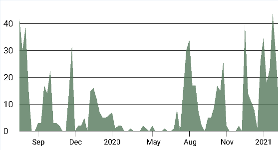
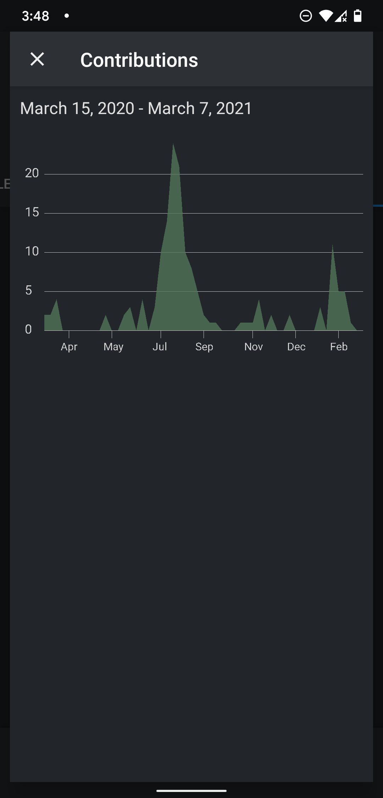

# Github Contribution for FastHub


This repository maintains a custom view that shows github's contribution graph (a component made for [FastHub](https://github.com/k0shk0sh/FastHub) app).

The view is optimized to handle thousands of week data & take minimum time for inflation. Run the benchmark [instrumented test](https://github.com/KaustubhPatange/fasthub-contribution-view/blob/master/sample/src/androidTest/java/com/kpstv/github_sample/BenchmarkTest.kt).



<>



<>

Above is the screenshot of this view being used in my FastHub's [fork](https://github.com/KaustubhPatange/FastHub).

## Usage

```xml
<com.kpstv.github.GraphView
   android:id="@+id/graphView"
   android:layout_width="match_parent"
   android:layout_height="wrap_content"/>
```

- Make a rest request to GitHub's Insight API & map the weeks data into `GraphModel` data class.

```kotlin
val weeks : List<GraphModel> = ... // serialize json
graphview.graphData = weeks
```

| Attibutes              |                                                                    |
| ---------------------- | ------------------------------------------------------------------ |
| `app:textColor`        | Set the color of all the text including commit no & timeline text. |
| `app:graphColor`       | Set the color of graph.                                            |
| `app:lineColor`        | Set the color of horizontal & vertical line.                       |
| `app:lineThickness`    | Set the thickness of the lines.                                    |
| `app:commitTextSize`   | Set the commit no text size.                                       |
| `app:timelineTextSize` | Set the text size of (bottom) timeline text.                       |

## Download

Library is available at `MavenCentral()`.

```groovy
implementation 'io.github.kaustubhpatange:github-contribution-view:<version>'
```

## License

- [The Apache License Version 2.0](https://www.apache.org/licenses/LICENSE-2.0.txt)

```
Copyright 2020 Kaustubh Patange

Licensed under the Apache License, Version 2.0 (the "License");
you may not use this file except in compliance with the License.
You may obtain a copy of the License at

   https://www.apache.org/licenses/LICENSE-2.0

Unless required by applicable law or agreed to in writing, software
distributed under the License is distributed on an "AS IS" BASIS,
WITHOUT WARRANTIES OR CONDITIONS OF ANY KIND, either express or implied.
See the License for the specific language governing permissions and
limitations under the License.
```
